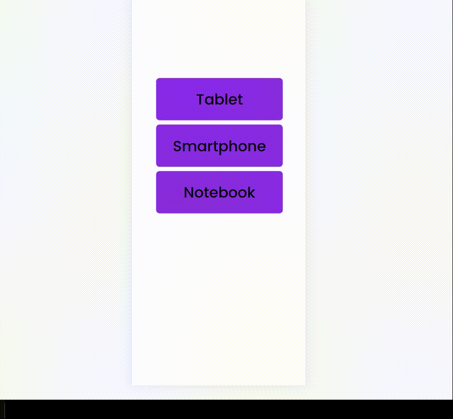
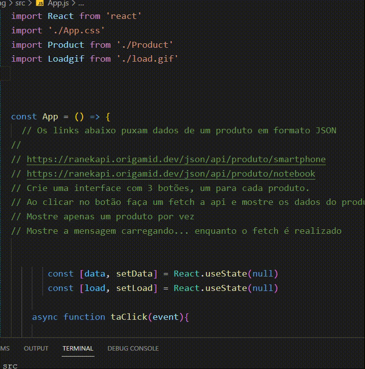

 <h2>Fetch, Responsiveness and Usestate</h2>
    
Trainning to fetch data and showing its properties.

 <h2> Responsiveness Applied</h2>
 
 A simples responsiveness applied, using @media CSS.

 <h2> Code Showingcase</h2>
 
 Fetch without async, just using it directly, and catching data. 

 
    

 
 

